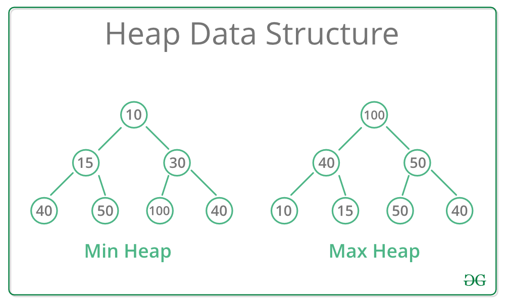

# Min Heap 구현 (Array 기반 Complete Binary Tree)

## 1. 최소 힙(Min Heap)의 개념


<출처: https://www.geeksforgeeks.org/heap-data-structure/minheapandmaxheap/>

최소 힙은 모든 부모 노드가 자식 노드보다 작거나 같은 값을 가지는 완전 이진 트리 자료구조입니다. 첨부된 이미지의 왼쪽 트리처럼, 루트 노드에는 전체 데이터 중 가장 작은 값이 항상 위치하게 됩니다. 각 층에서 부모는 자식보다 항상 작지만, 형제 노드나 서로 다른 서브 트리 간의 크기 순서는 보장되지 않는 느슨한 정렬 상태를 유지합니다. 데이터의 삽입과 삭제가 발생할 때마다 이 규칙을 지키기 위해 노드 위치를 조정하며 최솟값을 상단으로 유지합니다. 

파이썬의 `heapq` 모듈은 **최소 힙(Min Heap)** 구조를 제공합니다. 모든 부모 노드가 자식 노드보다 작거나 같은 값을 갖는 **완전 이진 트리(Complete Binary Tree)** 를 기본으로 하며, 이를 메모리 효율성을 위해 별도의 노드 객체 대신 **리스트(Array)** 로 관리합니다.

## 2. 힙의 구조와 인덱스 관계

완전 이진 트리이므로 리스트의 인덱스만으로 부모와 자식의 위치를 계산할 수 있습니다. (현재 노드 인덱스: $i$)

- **Parent index:** $(i - 1) // 2$
    - 조건: $i > 0$ (루트 노드인 $i=0$은 부모가 없음)
- **Left Child index:** $2i + 1$
    - 존재 조건: $2i + 1 < N$
- **Right Child index:** $2i + 2$
    - 존재 조건: $2i + 2 < N$
- **Leaf Node(단말 노드) 범위:** $N // 2 \le i < N$
    - 자식 노드가 하나도 없는 노드들의 시작점입니다.


## 3. MinHeap 클래스 구현

```python
class MinHeap:
    def __init__(self):
        self.heap = []

    def is_empty(self):
        return len(self.heap) == 0

    def push(self, data):
        """데이터 추가 후 상향 이동 (Sift-up)"""
        self.heap.append(data)
        self._sift_up(len(self.heap) - 1)

    def _sift_up(self, idx):
        parent_idx = (idx - 1) // 2
        # 부모가 존재하고, 현재 노드가 부모보다 작으면 교체
        if idx > 0 and self.heap[idx] < self.heap[parent_idx]:
            self.heap[idx], self.heap[parent_idx] = self.heap[parent_idx], self.heap[idx]
            self._sift_up(parent_idx)

    def pop(self):
        """루트 노드 삭제 후 하향 이동 (Sift-down)"""
        if self.is_empty():
            return -1
        
        if len(self.heap) == 1:
            return self.heap.pop()

        # 루트와 마지막 노드 교체 후 마지막 삭제
        root_data = self.heap[0]
        self.heap[0] = self.heap.pop()
        self._sift_down(0)
        
        return root_data

    def _sift_down(self, idx):
        smallest = idx
        left = 2 * idx + 1
        right = 2 * idx + 2
        n = len(self.heap)

        # 왼쪽 자식과 비교
        if left < n and self.heap[left] < self.heap[smallest]:
            smallest = left
        
        # 오른쪽 자식과 비교
        if right < n and self.heap[right] < self.heap[smallest]:
            smallest = right

        # 자식 중 더 작은 값이 있다면 교체 후 계속 하강
        if smallest != idx:
            self.heap[idx], self.heap[smallest] = self.heap[smallest], self.heap[idx]
            self._sift_down(smallest)

    def peek(self):
        return self.heap[0] if not self.is_empty() else -1

    def __len__(self):
        return len(self.heap)

```

## 요약 (Summary)

* **완전 이진 트리:** `heapq`는 리스트를 사용하지만 논리적으로는 완전 이진 트리입니다. 새로운 노드는 항상 트리의 마지막 빈 자리에 채워지며, 삭제 시에도 구조적 균형을 유지합니다.
* **시간 복잡도:** 삽입(`push`)과 삭제(`pop`) 모두 트리의 높이에 비례하는 $O(\log N)$의 시간 복잡도를 가집니다. 최솟값 확인(`peek`)은 루트 노드만 확인하므로 $O(1)$입니다.
* **효율적인 인덱스 연산:** 별도의 `Node` 클래스 객체를 생성하고 포인터를 관리하는 대신, 배열의 인덱스 산술 연산으로 부모-자식 관계를 정의하여 메모리 오버헤드를 줄이고 캐시 효율성을 높입니다.
* **정렬 상태:** 전체가 정렬된 상태는 아니며, 오직 "부모가 자식보다 작다"는 조건(Heap Property)만 만족합니다. 따라서 번째 최솟값을 찾으려면 번 `pop`을 수행해야 합니다.

